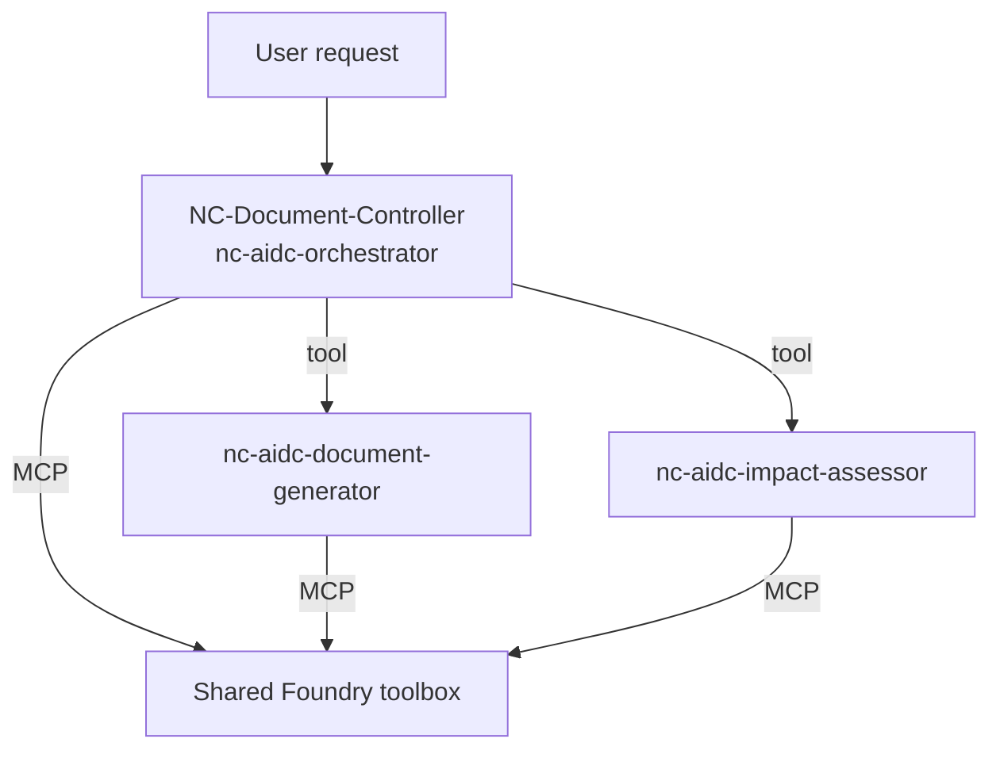

# Nexa Holdings — NC-Document-Controller

**NC-Document-Controller** is a multi-agent system for **Nexa Holdings** that automates
the creation, assessment, and distribution of corporate documents on
**Microsoft Foundry Agent Service**.

It is packaged as a **hosted (containerized) agent** built with the
[Microsoft Agent Framework](https://learn.microsoft.com/en-us/agent-framework/) and
deployed to Foundry via GitHub Actions. All document capabilities come from a shared,
externally-managed **Foundry toolbox** attached to every agent over MCP.

## Architecture

A single hosted agent — **NC-Document-Controller** (the orchestrator,
`nc-aidc-orchestrator`) — runs in the container and delegates to **two sub-agents** that
run in-process and are attached to it as tools:

| Agent | Name | Role |
| --- | --- | --- |
| Orchestrator (deployed agent) | `nc-aidc-orchestrator` | Routes requests, coordinates sub-agents, files documents, and returns final results. |
| Document Generator (sub-agent tool) | `nc-aidc-document-generator` | Physically creates `.docx` documents from SharePoint templates. |
| Impact Assessor (sub-agent tool) | `nc-aidc-impact-assessor` | Assesses the organisational impact of a proposed change and routes approvals. |

All three agents share one Foundry chat client and one **toolbox** connection. The
toolbox is a Foundry-hosted MCP server (`FOUNDRY_TOOLBOX_MCP_URL`) that exposes every
document tool and skill — the WorkIQ Word and WorkIQ SharePoint integrations,
plus the document-taxonomy, annual-business-plan and impact-assessment skills. Because it
is a hosted MCP server in the same project, tool calls are executed by the service using
the agent's managed identity.



## Project layout

```
nc-aidc-agents/
├── main.py                 # Container entry point — serves /responses on :8088
├── config.py               # Runtime settings (project endpoint, model, toolbox URL)
├── Dockerfile              # Hosted-agent container image
├── .dockerignore
├── requirements.txt
├── agents/
│   ├── _shared.py          # Chat client, toolbox tool, and ChatAgent builder
│   ├── aidc_orchestrator.py + *_instructions.md
│   ├── document_generator.py + *_instructions.md
│   └── impact_assessor.py  + *_instructions.md
└── .github/workflows/deploy.yml   # Build + deploy pipeline
```

## Deployment (GitHub Actions)

Deployment is fully automated by [`.github/workflows/deploy.yml`](.github/workflows/deploy.yml)
using the **Azure Developer CLI (`azd`)** and its Foundry agent extension. Pushes to
`development` and `main` deploy the agent into the existing Foundry project via
`azd deploy` — Foundry builds the runtime image from the uploaded source (code deploy /
remote build, driven by [`azure.yaml`](azure.yaml)), creates a new hosted-agent version,
provisions the container, and assigns the RBAC the agent identity needs. No local Docker
build or Azure Container Registry endpoint is required.

1. **Azure Login** via OIDC (`azure/login` and `azd auth login` federated credential).
2. **Install** the `azure.ai.projects` and `azure.ai.agents` azd extensions.
3. **Fetch settings** (Foundry endpoint, toolbox MCP URL) from Azure Key Vault, and
   resolve the project's ARM ID and region from the endpoint.
4. **Configure the azd environment** — subscription, `AZURE_LOCATION` (the Foundry
   project region, required for code deploy), model deployment, toolbox URL, and the
   project endpoint/ID.
5. **`azd deploy`** builds, publishes, and provisions the hosted agent
   `nc-document-controller` over the `responses` protocol, then **verifies** with
   `azd ai agent show`.

### Required Key Vault secrets

Per environment (`dev-` / `prod-` prefix):

- `<env>-foundry-project-endpoint`
- `<env>-foundry-toolbox-mcp-url`

### Required GitHub secrets

`AZURE_CLIENT_ID`, `AZURE_TENANT_ID`, `AZURE_SUBSCRIPTION_ID`, `AZURE_KEY_VAULT_NAME`.

## Local development

The container serves an OpenAI-compatible `/responses` endpoint on port **8088**.

```bash
# 1. Create and activate a virtual environment (Python 3.13)
python -m venv .venv
.venv\Scripts\activate        # Windows
# source .venv/bin/activate   # macOS / Linux

# 2. Install dependencies (Agent Framework hosting packages are preview)
pip install --pre -r requirements.txt

# 3. Configure environment
copy .env.sample .env         # then edit values (Windows)

# 4. Run the agent host
python main.py

# 5. Invoke it
curl -sS -H "Content-Type: application/json" -X POST http://localhost:8088/responses \
  -d '{"input": "Where is the FY26 Annual Business Plan filed?", "stream": false}'
```

Authentication uses `DefaultAzureCredential` locally (e.g. `az login`); in Foundry the
hosted agent uses its own managed identity.

## Requirements

- Python **3.13**
- Access to a Microsoft Foundry project, a model deployment (default `claude-sonnet-4-6`),
  and the shared toolbox.
